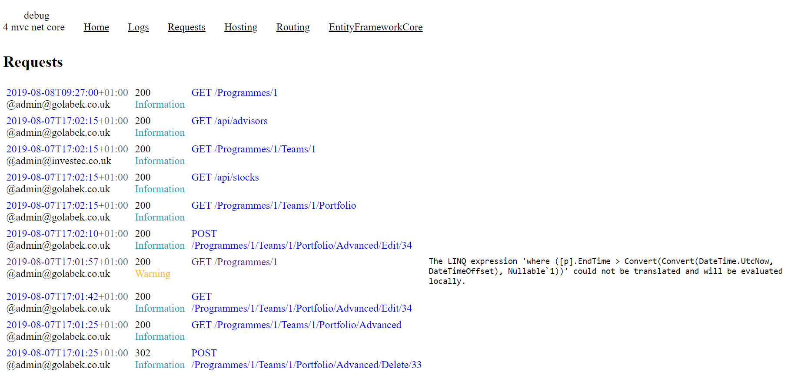
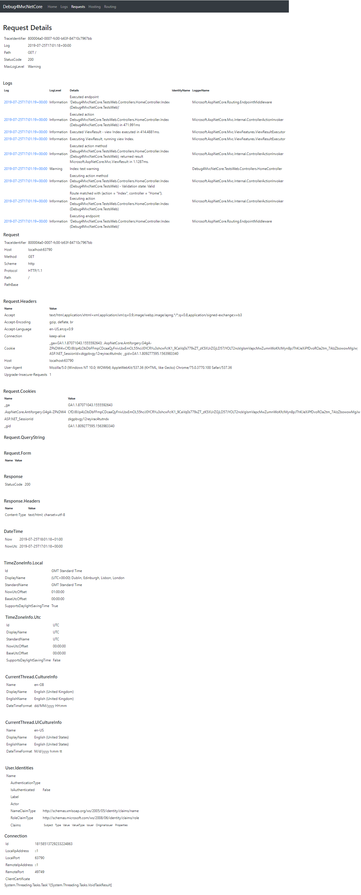
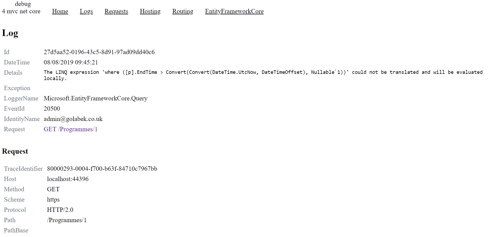
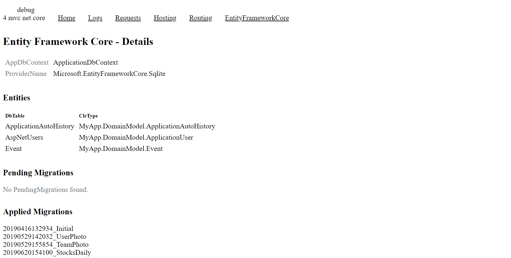
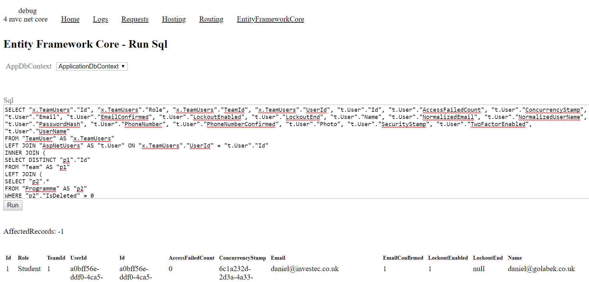
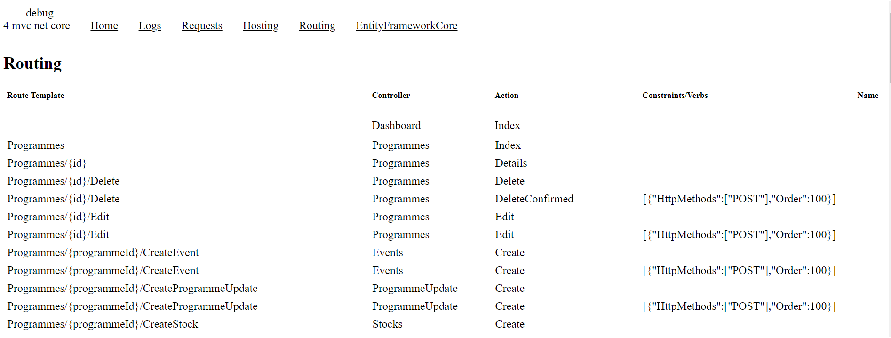

# Debug4MvcNetCore

ASP Mvc .Net Core debugging tool.
* Logs requests details
* Logs all messages
* Displays server information
* Display routing information
* Display hosting information
* Display EntityFramework context details
* Run SQL queryies on EntityFramework context


## Instalation
 ```cs
 Install-Package Debug4MvcNetCore
```

## Usage
 ```cs
public void Configure(IApplicationBuilder app, IServiceProvider serviceProvider, IHostingEnvironment env)
{
            // Use Debug4MvcNetCore middleware
            app.UseDebug4MvcNetCore();
            
            app.UseStaticFiles();
            app.UseCookiePolicy();
            app.UseMvc(routes =>
            {
                routes.MapRoute(
                    name: "default",
                    template: "{controller=Dashboard}/{action=Index}/{id?}");
            });
}
```
Run the app and navigate to http://localhost/debug

&nbsp;

&nbsp;

## Track requests details

&nbsp;

* List all requests with status and max log level


&nbsp;

* Show request details, including all logs.



&nbsp;

* Show log details


&nbsp;

## Display EntityFramework Core context details

&nbsp;

* Show migrations, tables and models

&nbsp;



&nbsp;

* Let you run SQL on context

&nbsp;



&nbsp;

## Display routing information

&nbsp;



