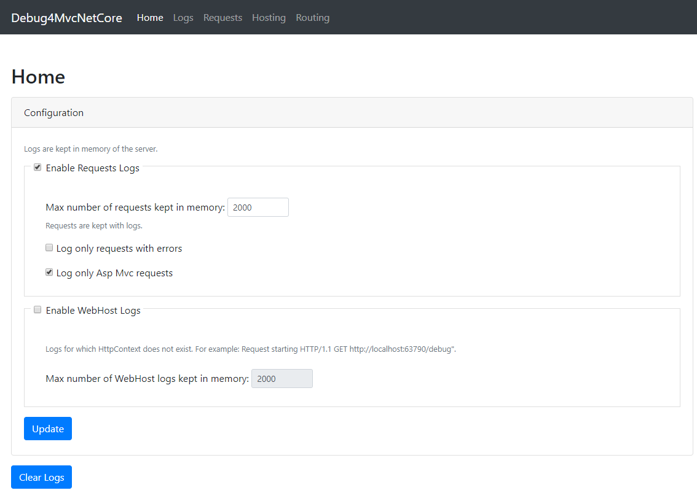
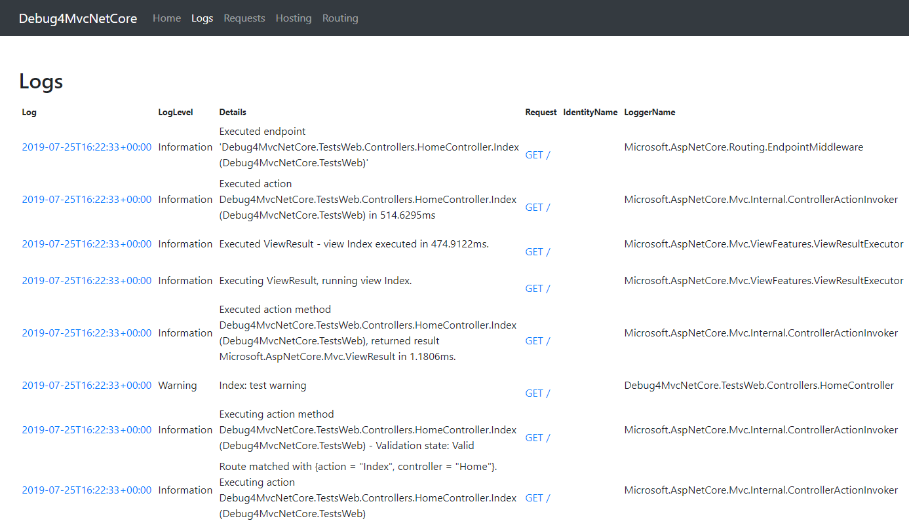
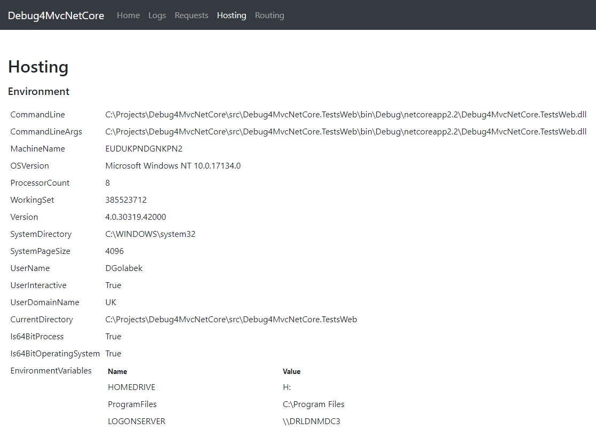

# Debug4MvcNetCore

ASP Mvc .Net Core debugging tool.
* Logs requests details
* Logs all messages
* Displays server information
* Display routing information


## Instalation
 ```cs
 Install-Package Debug4MvcNetCore
```

## Usage
 ```cs
public void Configure(IApplicationBuilder app, IServiceProvider serviceProvider, IHostingEnvironment env)
{
            // Use Debug4MvcNetCore middleware
            app.UseDebug4MvcNetCore();
            
            app.UseStaticFiles();
            app.UseCookiePolicy();
            app.UseMvc(routes =>
            {
                routes.MapRoute(
                    name: "default",
                    template: "{controller=Dashboard}/{action=Index}/{id?}");
            });
}
```
Run the app and navigate to http://localhost/debug

## Screenshots








