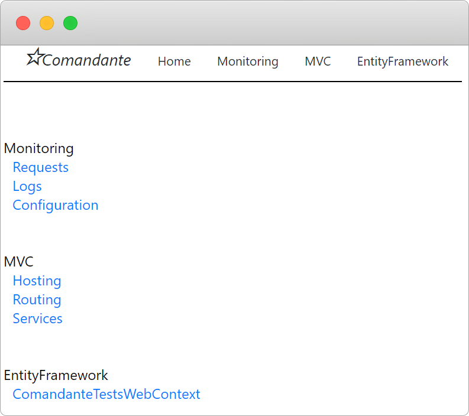
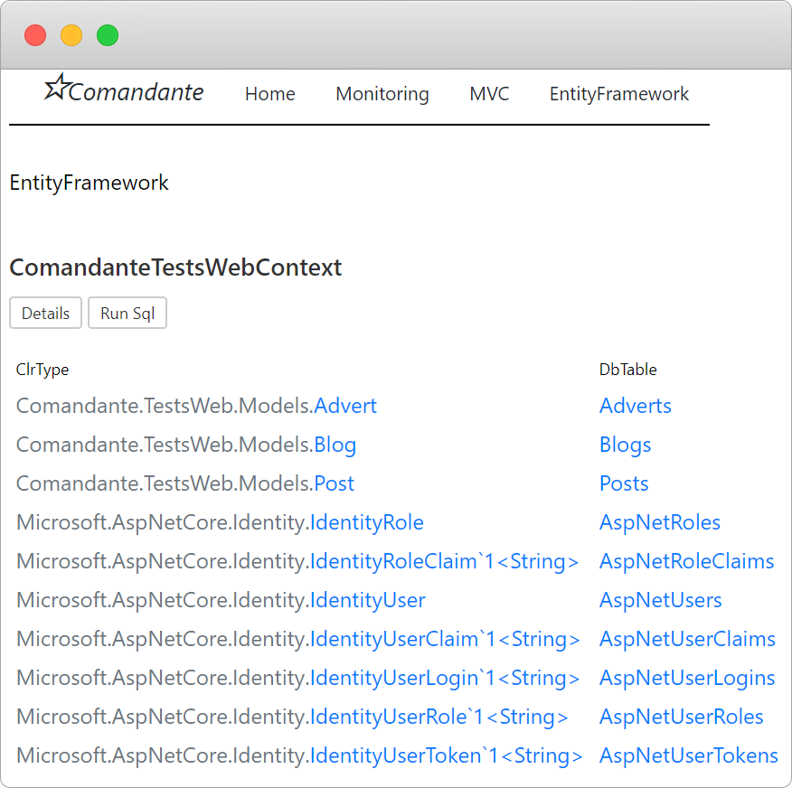
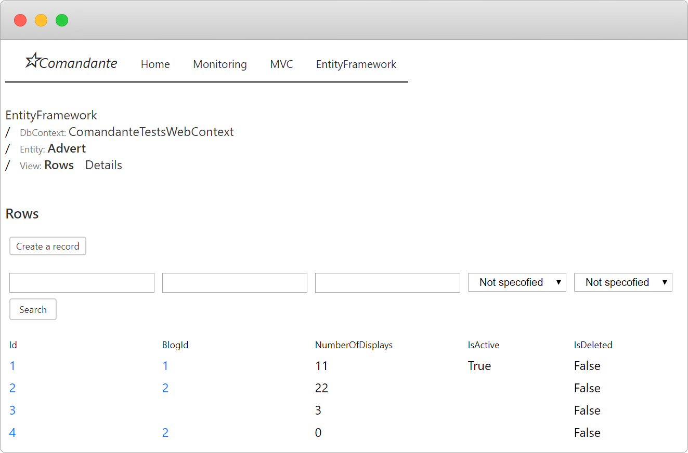
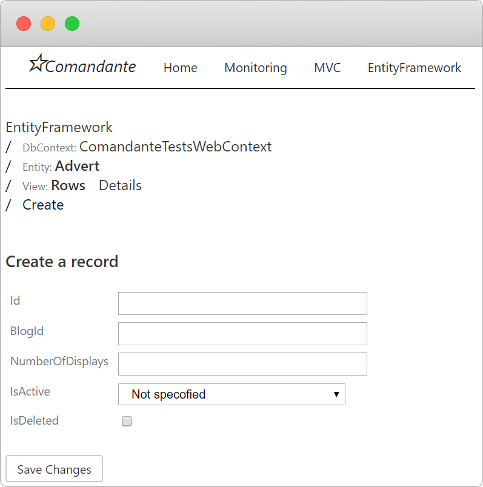
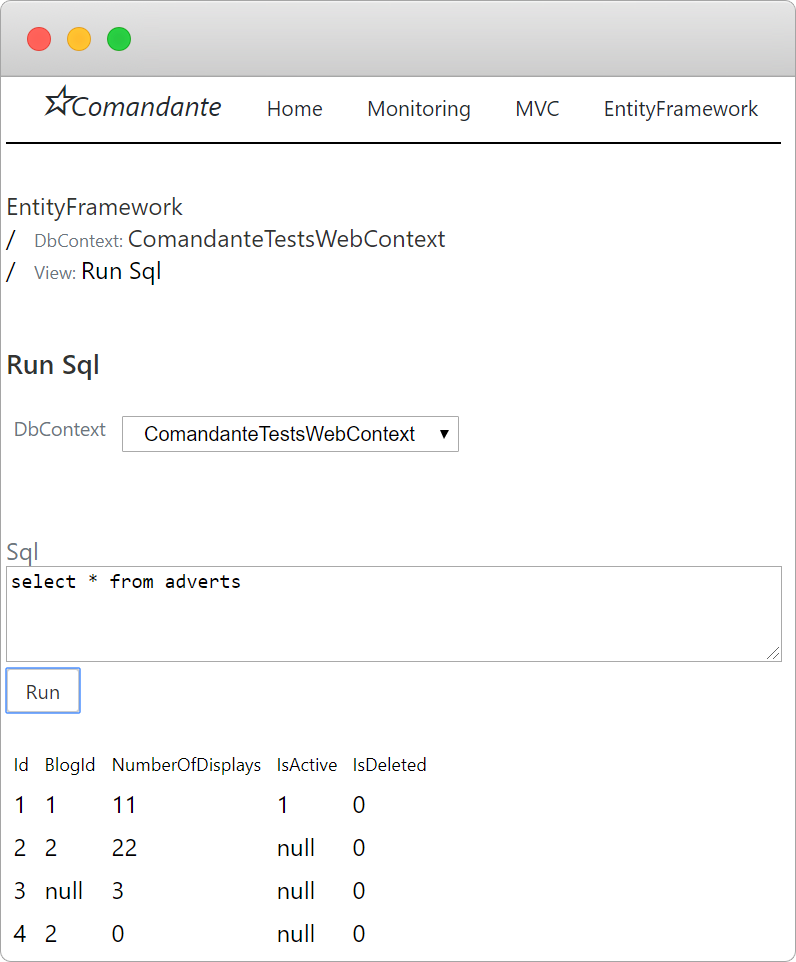
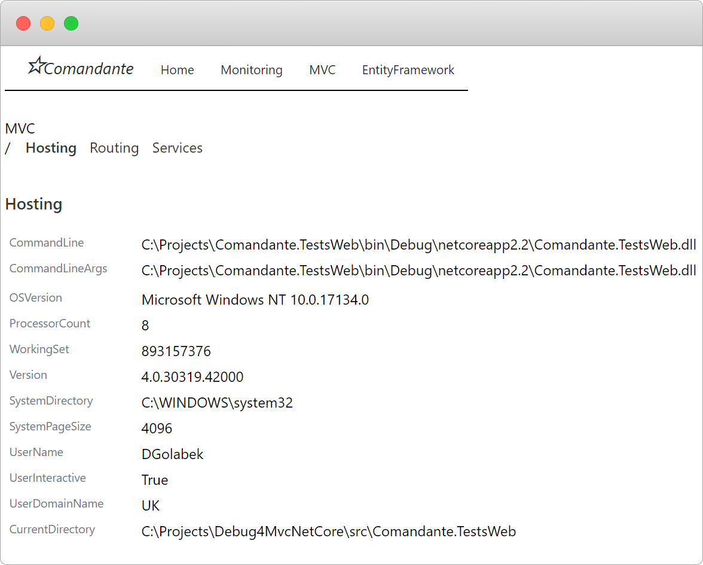
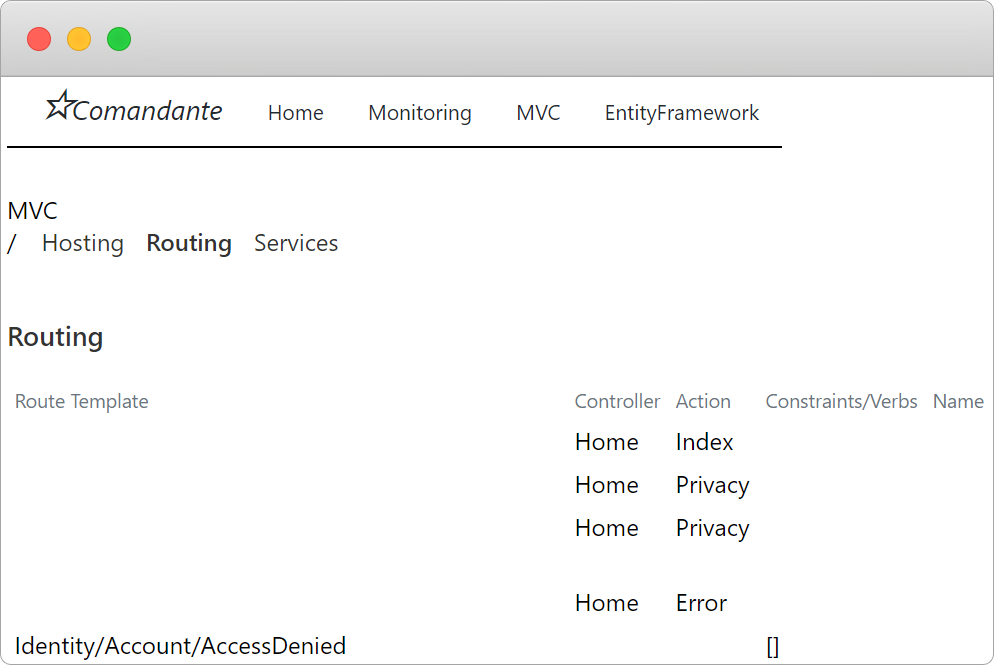
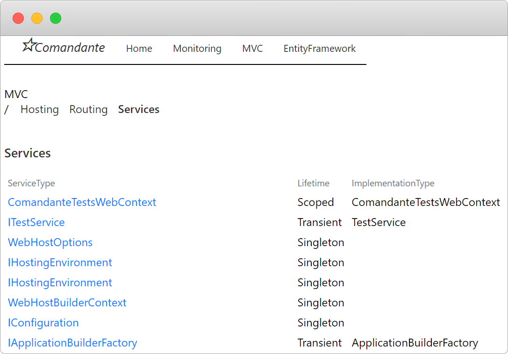
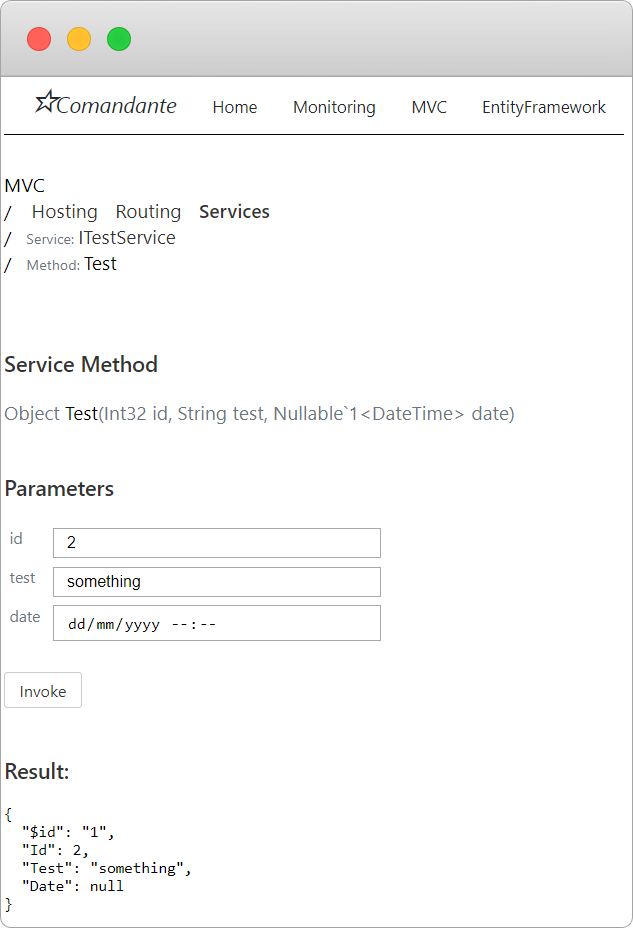
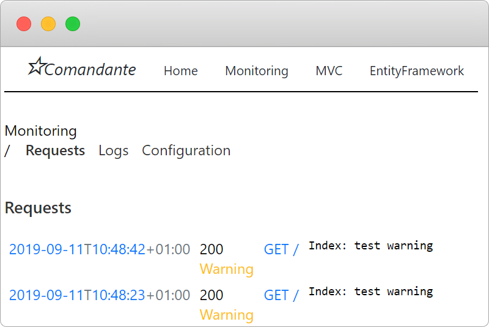

# Comandante

ASP MVC .Net Core debugging tool.
* Logs requests details
* Logs all messages
* Displays server information
* Display routing information
* Display hosting information
* Display EntityFramework context details
* Run SQL queryies on EntityFramework context


# Instalation
 ```cs
 Install-Package Comandante
```

# Usage
 ```cs
public void ConfigureServices(IServiceCollection services)
{
   // Add Comandante service
    services.AddComandante();
}
        
public void Configure(IApplicationBuilder app, IServiceProvider serviceProvider, IHostingEnvironment env)
{
    // Use Comandante middleware
    app.UseComandante();
}
```
Run the app and navigate to http://localhost/comandante


&nbsp;

&nbsp;


# Entity Framework










# MVC









# Monitoring



